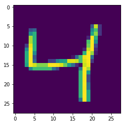

### [](#header-2)What is Multi Layer Perceptron

A multilayer perceptron [MLP](https://en.wikipedia.org/wiki/Multilayer_perceptron) is a class of feedforward artificial neural network. An MLP consists of at least three layers of nodes. Except for the input nodes, each node is a neuron that uses a nonlinear activation function. MLP utilizes a supervised learning technique called backpropagation for training. Its multiple layers and non-linear activation distinguish MLP from a linear perceptron. It can distinguish data that is not linearly separable.

Multilayer perceptrons are sometimes colloquially referred to as **vanilla** neural networks, especially when they have a single hidden layer.

In the case of regression problems, the average of the predicted attribute may be returned. In the case of classification, the most prevalent class may be returned.

{:width="60%"}

### [](#header-3)MLP Simple Implementation using Keras

Import keras
```python

from __future__ import print_function
import matplotlib.pyplot as plt
import keras
from keras.datasets import mnist
from keras.models import Sequential
from keras.layers import Dense, Dropout
from keras.optimizers import RMSprop, SGD
```

Load dataset
```python
from keras.datasets import mnist
(x_train, y_train), (x_test, y_test) = mnist.load_data()
```

Explore the shape of dataset
```python
print (x_train.shape)
# (60000, 28, 28)
```

Explore some random images in dataset

```python
def show_img(img,y):
    """ Util: to show an image """
    plt.clf()
    print(y)
    plt.imshow(img)

index = 2 # a random image from dataset
show_img(x_train[index], y_train[index])
```


Reshape & Scale your input features.

```python
x_train = x_train.reshape(-1, 784)
x_test = x_test.reshape(-1, 784)

x_train = x_train.astype("float32") / 255
x_test = x_test.astype("float32") / 255
```

Convert single output unit to 10 Units. ( conver to categorical of class_size #10)

```python
num_classes = 10
y_train = keras.utils.to_categorical(y_train, num_classes=num_classes)
y_test = keras.utils.to_categorical(y_test, num_classes=num_classes)
```

Inspect the shape of y_train

```python
print ( y_test.shape)
# (10000, 10)
```

Finally, Lets Build the Model

```python
model = Sequential()

model.add( Dense( 512, activation="relu", input_shape=(784,) ) )
model.add(Dense(num_classes, activation='softmax'))

model.summary()
```

Compile the Model

```python
model.compile(loss='categorical_crossentropy',
              optimizer=SGD(),
              metrics=['accuracy'])

```

Fit the Model

```python
history = model.fit(x_train, y_train,
                    batch_size=batch_size,
                    epochs=epochs,
                    verbose=1,
                    validation_data=(x_test, y_test))
```

Output:

```bash
Train on 60000 samples, validate on 10000 samples
Epoch 1/20
60000/60000 [==============================] - 1s 13us/step - loss: 1.1346 - acc: 0.7458 - val_loss: 0.5323 - val_acc: 0.8751
Epoch 2/20
60000/60000 [==============================] - 1s 10us/step - loss: 0.4547 - acc: 0.8824 - val_loss: 0.3722 - val_acc: 0.9015
Epoch 3/20
60000/60000 [==============================] - 1s 10us/step - loss: 0.3609 - acc: 0.9010 - val_loss: 0.3192 - val_acc: 0.9131
Epoch 4/20
60000/60000 [==============================] - 1s 10us/step - loss: 0.3197 - acc: 0.9101 - val_loss: 0.2895 - val_acc: 0.9193
Epoch 5/20
60000/60000 [==============================] - 1s 11us/step - loss: 0.2937 - acc: 0.9171 - val_loss: 0.2700 - val_acc: 0.9245
Epoch 6/20
60000/60000 [==============================] - 1s 10us/step - loss: 0.2737 - acc: 0.9228 - val_loss: 0.2538 - val_acc: 0.9279
Epoch 7/20
60000/60000 [==============================] - 1s 10us/step - loss: 0.2575 - acc: 0.9272 - val_loss: 0.2415 - val_acc: 0.9327
Epoch 8/20
60000/60000 [==============================] - 1s 10us/step - loss: 0.2439 - acc: 0.9312 - val_loss: 0.2288 - val_acc: 0.9353
Epoch 9/20
60000/60000 [==============================] - 1s 11us/step - loss: 0.2317 - acc: 0.9344 - val_loss: 0.2180 - val_acc: 0.9384
Epoch 10/20
60000/60000 [==============================] - 1s 10us/step - loss: 0.2209 - acc: 0.9383 - val_loss: 0.2109 - val_acc: 0.9399
Epoch 11/20
60000/60000 [==============================] - 1s 10us/step - loss: 0.2110 - acc: 0.9411 - val_loss: 0.2028 - val_acc: 0.9417
Epoch 12/20
60000/60000 [==============================] - 1s 10us/step - loss: 0.2023 - acc: 0.9436 - val_loss: 0.1948 - val_acc: 0.9446
Epoch 13/20
60000/60000 [==============================] - 1s 10us/step - loss: 0.1941 - acc: 0.9456 - val_loss: 0.1897 - val_acc: 0.9459
Epoch 14/20
60000/60000 [==============================] - 1s 10us/step - loss: 0.1867 - acc: 0.9483 - val_loss: 0.1809 - val_acc: 0.9490
Epoch 15/20
60000/60000 [==============================] - 1s 10us/step - loss: 0.1797 - acc: 0.9498 - val_loss: 0.1745 - val_acc: 0.9501
Epoch 16/20
60000/60000 [==============================] - 1s 10us/step - loss: 0.1732 - acc: 0.9516 - val_loss: 0.1699 - val_acc: 0.9518
Epoch 17/20
60000/60000 [==============================] - 1s 10us/step - loss: 0.1670 - acc: 0.9533 - val_loss: 0.1666 - val_acc: 0.9519
Epoch 18/20
60000/60000 [==============================] - 1s 10us/step - loss: 0.1616 - acc: 0.9546 - val_loss: 0.1605 - val_acc: 0.9543
Epoch 19/20
60000/60000 [==============================] - 1s 10us/step - loss: 0.1562 - acc: 0.9560 - val_loss: 0.1562 - val_acc: 0.9550
Epoch 20/20
60000/60000 [==============================] - 1s 10us/step - loss: 0.1513 - acc: 0.9577 - val_loss: 0.1520 - val_acc: 0.9564
```

## WELL DONE - Congragulations for building your first Model.

Lets plot the accuracy, loss of traning & test data using Tensorboard.

```python
import time
from keras.callbacks import TensorBoard

model = Sequential()

model.add( Dense( 512, activation="relu", input_shape=(784,) ) )
model.add(Dense(num_classes, activation='softmax'))

model.compile(loss='categorical_crossentropy',
              optimizer=SGD(),
              metrics=['accuracy'])

tb = TensorBoard('log_dir/mnist_mlp/%d' % time.time())

history = model.fit(x_train, y_train,
                    batch_size=batch_size,
                    epochs=epochs,
                    verbose=1,
                    validation_data=(x_test, y_test),
                    callbacks=[tb])

# acc: 0.9919 - val_loss: 0.0866 - val_acc: 0.9744
```

Further readings...TBA.

[back](../)